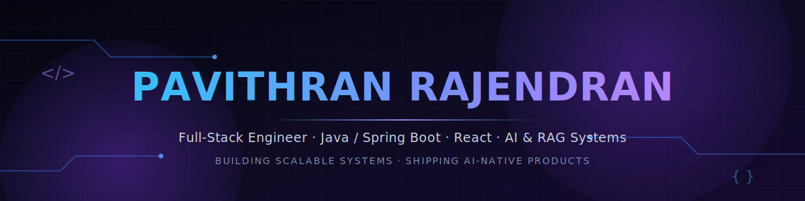

<div align="center">



<br/>

<a href="https://git.io/typing-svg">
  
</a>

<br/><br/>


<br/>


</div>

<br/>

## <samp>01 · ABOUT ME</samp>

<table>
<tr>
<td width="60%" valign="top">

I'm a full-stack engineer who builds things end-to-end — from tuning an Elasticsearch cluster to serve **sub-second search over 100K+ records**, to architecting **real-time WebSocket systems** at scale, to shipping **AI features backed by RAG pipelines** that actually hold up in production.

My core belief: good engineering is invisible. Systems that scale gracefully, APIs that respond in milliseconds, and AI features that feel native rather than bolted-on — that's the bar I hold my own work to.

Over the last 2 years I've worked across the stack on a large-scale **ERP platform**, owning modules end-to-end — from schema design to deployment — while also building independent projects exploring where **LLMs and traditional backend engineering intersect**.

</td>
<td width="40%" valign="top">

```json
{
  "role": "Full Stack Engineer",
  "experience": "2+ years",
  "core_stack": [
    "Java", "Spring Boot",
    "React", "Node.js", "TypeScript"
  ],
  "specialties": [
    "Distributed Systems",
    "Real-Time Architecture",
    "RAG & LLM Integration",
    "Search & Analytics at Scale"
  ],
  "mindset": "ship_fast(); scale_smart();",
  "open_to": "New Opportunities"
}
```

</td>
</tr>
</table>

<br/>

## <samp>02 · TECH STACK</samp>

<table width="100%">
<tr><td width="140" valign="top"><b>Frontend</b></td><td>


</td></tr>
<tr><td valign="top"><b>Backend</b></td><td>


</td></tr>
<tr><td valign="top"><b>Databases</b></td><td>


</td></tr>
<tr><td valign="top"><b>Cloud & DevOps</b></td><td>


</td></tr>
<tr><td valign="top"><b>AI / LLM</b></td><td>


</td></tr>
<tr><td valign="top"><b>Tools</b></td><td>


</td></tr>
</table>

<br/>

## <samp>03 · AI & LLM ENGINEERING</samp>

<table>
<tr>
<td width="33%" valign="top" align="center">

**Retrieval-Augmented Generation**
<br/>
<sub>Designing RAG pipelines that ground LLM outputs in real, retrievable context instead of relying on raw model recall.</sub>

</td>
<td width="33%" valign="top" align="center">

**LLM Integration**
<br/>
<sub>Embedding GPT-based reasoning into production workflows — structured outputs, streaming responses, and tool-calling.</sub>

</td>
<td width="33%" valign="top" align="center">

**Real-Time AI UX**
<br/>
<sub>Token-by-token streaming architectures (SSE) so AI features feel instant rather than batch-processed.</sub>

</td>
</tr>
</table>

<br/>

## <samp>04 · CURRENTLY</samp>

<table width="100%">
<tr>
<td width="50%" valign="top">

**☕ Working On**
- Production AI features using OpenAI APIs + RAG
- Deepening AWS solutions architecture skills
- Contributing to personal open-source tooling

</td>
<td width="50%" valign="top">

**📚 Learning**
- Advanced System Design & Distributed Systems
- Kubernetes & container orchestration
- AI agents & agentic workflow design

</td>
</tr>
</table>

<br/>

## <samp>05 · FEATURED PROJECTS</samp>

<table width="100%">
<tr>
<td width="50%" valign="top">
<h3>🧠 TalentLens AI</h3>
<p><sub>AI-powered resume analyzer with structured, explainable scoring</sub></p>


<p>Built a RAG-grounded resume evaluation engine — retrieves job-specific context before scoring, replacing generic LLM guesses with structured, defensible output.</p>
<a href="https://github.com/Pavithranluffy"></a>
</td>
<td width="50%" valign="top">
<h3>⚡ Nebula Stream</h3>
<p><sub>Real-time messaging platform, built for horizontal scale</sub></p>


<p>Real-time chat with presence tracking and group channels. Redis pub/sub scales WebSocket fan-out horizontally; containerized with Docker, deployed on Railway.</p>
<a href="https://github.com/Pavithranluffy"></a>
</td>
</tr>
<tr>
<td width="50%" valign="top">
<h3>🔍 ERP Search Platform</h3>
<p><sub>Enterprise search & analytics over 100K+ records</sub></p>


<p>Tuned aggregation pipelines and custom analyzers deliver sub-second filtered search across multi-field ERP datasets, eliminating manual data exports.</p>
<a href="https://github.com/Pavithranluffy"></a>
</td>
<td width="50%" valign="top">
<h3>🌐 Portfolio Website</h3>
<p><sub>Personal engineering portfolio</sub></p>


<p>Dark-themed, performance-first portfolio built to load fast and communicate engineering depth at a glance.</p>
<a href="https://pavithranr-portfolio.netlify.app/"></a>
</td>
</tr>
</table>

<br/>

## <samp>06 · GITHUB ANALYTICS</samp>

<div align="center">


<br/>


<br/>


</div>

<details>
<summary><b>🏆 GitHub Trophies</b></summary>
<br/>
<div align="center">

</div>
</details>

<details>
<summary><b>🐍 Contribution Snake</b></summary>
<br/>
<div align="center">

</div>
<sub>Renders automatically once the snake workflow (included below) runs on this repo.</sub>
</details>

<br/>

## <samp>07 · DEVELOPER PHILOSOPHY</samp>

<div align="center">

```
"Simple systems fail simply. Complex systems fail in ways nobody predicted.
 I build for the failure I can see coming — and design for the one I can't."
```

</div>

<br/>

## <samp>08 · CONNECT</samp>

<div align="center">

<a href="www.linkedin.com/in/pavithran-rp"></a>
<a href="https://pavithranr-portfolio.netlify.app/"></a>
<a href="mailto:pavithranrajendran2002@gmail.com"></a>
<a href="https://leetcode.com/Pavithranluffy"></a>

<br/><br/>


</div>

<br/>

<div align="center">


<br/>

<sub>Building software that scales, solving problems that matter.</sub>

</div>
